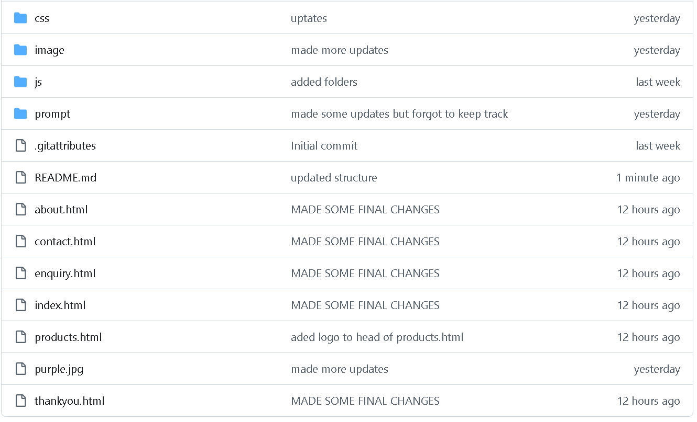

    Drip Cloud - Website Project (`README.md`)

>   Project Name:   Drip Cloud E-Commerce Website
>   Course:   Web Development (WEDE5020)
>   Student Name:   Vincent Jonas
>   Student ID:   ST10503108

--------------------------------------------------------

Project Overview
Drip Cloud is a modern South African streetwear brand platform developed as part of the Web Development coursework. This repository houses the multi-page digital storefront designed to transition the brand from social media sales to a fully structured, professional, and accessible web presence.

--------------------------------------------------------

Repository Structure
The project follows standard web development folder organization rules:

--------------------------------------------------------

Design & Styling
Layout Structure:   Features a fixed decorative background layout frame paired with an independent, smooth-scrolling inner
white content window.
Color Palette (Accent System):  
Products Page:    Red 
About Page:    Blue 
Enquiry Page: orange
Contact Page:  Green    Homepage:   Purple 

--------------------------------------------------------

 How to Run Locally

1. Clone the repository to your local machine:
bash
git clone https://github.com/vincentjonas065/DripCloud-website.git

2. Open the project folder in   VS Code  .
3. Use the   Live Server   extension or open `index.html` directly in any modern web browser.